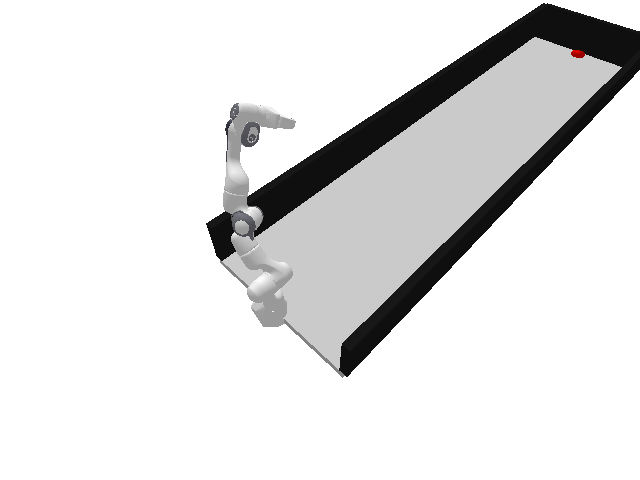

# Track n' Cept

**Track n’ Cept** is a control framework for tracking and intercepting a moving puck using vision-based feedback. The project compares two control strategies:

- **Image-Based Visual Servoing (IBVS)** using proportional control  
- **Model Predictive Control (MPC)** accounting for system delay and puck trajectory prediction  

The objective is to evaluate **reactive** and **predictive** control methods under varying puck motion scenarios.

---

##  Demo

### MPC - Straight Trajectory


### MPC - Angled Trajectory


### IBVS - Angled Trajectory


---

## Overview

This project:
- Tracks a moving puck using image-based visual feedback  
- Generates control commands for interception  
- Accounts for system response delay and puck trajectory  
- Compares IBVS and MPC performance across scenarios  

---

## Repository Structure

- `IBVS.py`: Image Based Visual Servoing
- `MPC.py`: Model Predictive Control 
- `test.py`: Testing under different scenarios
- `test_fk.py`: Forward kinematics testing
- `src/env_robot.py`: Robot and environment setup in pybullet
- `src/utils.py`: Helper utilities


---

## Requirements

- Python 3.x  
- PyBullet
- NumPy  
- CasADi
- OpenCV
- SciPy

---

##  Usage

### Run individual control strategies
```bash
python IBVS.py
python MPC.py
```

### Run tests under different scenarios
```bash
python test.py
```

---

## Results

$$
\begin{array}{|c|c|c|c|}
\hline
\textbf{Puck Velocity} & \textbf{Trajectory} & \textbf{IBVS Success Rate} & \textbf{MPC Success Rate} \\
\hline
(0, v, 0) & \text{Straight} & 0.9 & 1.0 \\
(u, -3.5, 0) & \text{Angled} & 0.5 & 1.0 \\
\hline
\end{array}
$$

**Observations:**
- IBVS performs reliably for straight-line motion  
- Performance degrades for angled trajectories due to delay  
- MPC improves robustness by predicting future puck states, but depends on model accuracy  

---

##  Key Takeaways

- IBVS is simple and effective for predictable motion  
- MPC handles delays and complex trajectories better  
- Accurate system and trajectory modeling is critical  

---

## Future Work

- Improve robustness to noisy visual measurements  
- Enhance puck trajectory prediction  
- Extend to dynamic obstacles or multiple pucks  
- Explore learning-based control approaches


